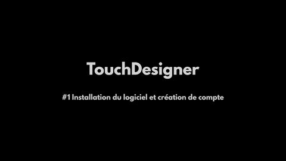
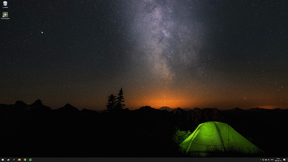
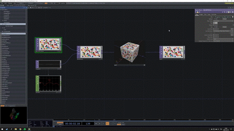
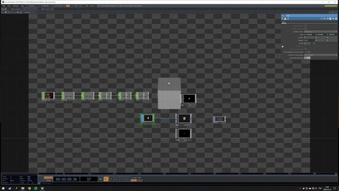

# Introduction_TouchDesigner
This is a french introduction to TouchDesigner - Cours d'introduction à TouchDesigner.

Vous pourrez trouver l'ensemble des vidéos sur [ma chaîne youtube](https://www.youtube.com/channel/UC0vDTmgc8IPO2Rs7kxh-tdQ/playlists)

## Vidéos d'introduction

### Présentation et installation

### Interface et opérateurs

### Rendu 3D

### Interactivité

### Compositing

### Projet 1

### Instances

### Projet 2

## Ressources supplémentaires

- Exemples réalisé par [Mael Pinar](https://maelpinard.cargo.site/) aka Pinarson sur [github](https://github.com/pinarson/TD)

- Vidéos youtube en anglais par [Bileam Tschepe](https://www.youtube.com/channel/UCONptu0J1PCrW9YfBtSdqjA)

- Ressource du site officiel [Touch Designer](https://docs.derivative.ca/Learning_TouchDesigner)

- Site web anglais [alltd](http://alltd.org/)

### Veille artistes et studio sur TouchDesigner

[DeadMau5](https://derivative.ca/community-post/made-love-touchdesigner-v99-cusersdeadmau5)

[Monocolor](https://mnclr.com/)

[Intus](https://www.intus.tv/en/submerge)

[Vincent Houzé](https://vincenthouze.com/portfolio/fluid-structure-360/) 

[Immersive HQ](https://interactiveimmersive.io/blog/affiliate-work/mafd-mapping-active-fire-data/) 

[Immersive HQ 2](https://interactiveimmersive.io/blog/affiliate-work/viscerality/)